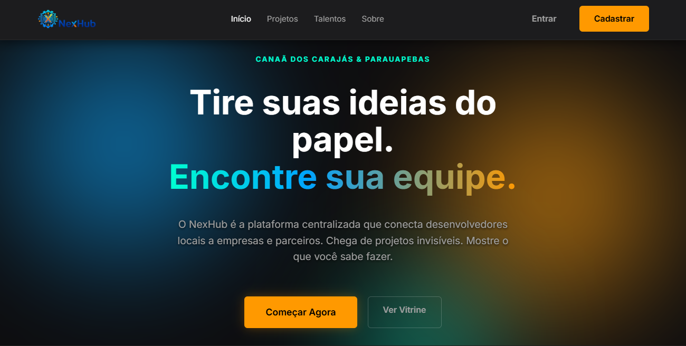
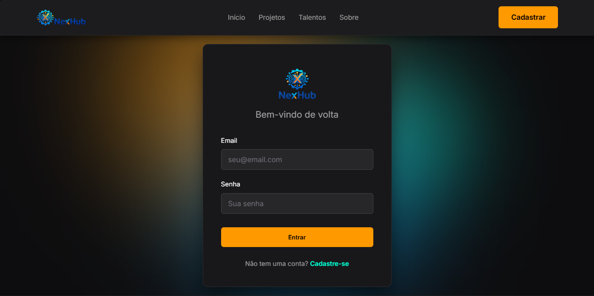
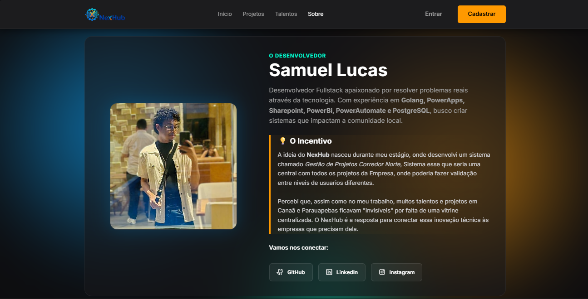

  

    

  <h1>🌌 NexHub</h1>
  
  <h3>O Ecossistema de Inovação do Sudeste do Pará</h3>

  

    <b>Canaã dos Carajás</b> • <b>Parauapebas</b>
  

  

    
    
    
  

 

---

## 🔭 Sobre o Sistema

O **NexHub** é uma plataforma de software desenvolvida exclusivamente como **Trabalho de Conclusão de Curso (TCC)**. 

O objetivo do sistema é resolver a "invisibilidade tecnológica" na região de Canaã dos Carajás e Parauapebas. Ele atua como uma **Supernova**, iluminando projetos locais e conectando desenvolvedores talentosos a empresas que precisam de soluções, criando um hub centralizado de oportunidades.

> ⚠️ **Nota:** *Este é um projeto de código fechado (Closed Source). O repositório serve apenas para fins de documentação e portfólio acadêmico.*

---

## 🚀 Funcionalidades Principais

O sistema conecta duas pontas do mercado através de uma arquitetura robusta:

### 🌟 Módulo: Talentos (Devs)
* **Vitrine de Projetos:** Portfólio digital para expor softwares, TCCs e protótipos criados na região.
* **Perfil Profissional:** Exibição dinâmica de Stacks (Linguagens e Ferramentas).
* **Networking:** Ferramentas para encontrar sócios e formar equipes multidisciplinares.

### 🏢 Módulo: Empresas (Corporativo)
* **Headhunting Regional:** Busca de profissionais filtrada por habilidades específicas (ex: "Golang", "React") e cidade.
* **Vitrine de Soluções:** Catálogo de softwares prontos para resolver dores do comércio e indústria local.
* **Conexão Direta:** Chat interno para negociação sem intermediários.

---

## 🎨 Interface & Design

O projeto utiliza o conceito visual **"Dark Glassmorphism"**, inspirado no espaço sideral. A interface foi desenhada para ser imersiva, moderna e destacar o conteúdo tecnológico.

  
  

      
      
  

---

## 🛠 Stack Tecnológica

O NexHub foi construído com foco em alta performance, segurança e escalabilidade, utilizando tecnologias modernas de desenvolvimento web.

<table>
  <tr>
    <td align="center" width="120">
       
      <b>Golang</b> Backend
    </td>
    <td align="center" width="120">
       
      <b>PostgreSQL</b> Database
    </td>
    <td align="center" width="120">
       
      <b>Web</b> Frontend Puro
    </td>
    <td align="center" width="120">
       
      <b>VPS</b> Infraestrutura
    </td>
    <td align="center" width="120">
       
      <b>GitHub</b> Versionamento
    </td>
  </tr>
</table>

### Arquitetura
O sistema segue o padrão arquitetural **MVC (Model-View-Controller)**, garantindo organização, manutenibilidade e separação clara de responsabilidades entre a interface, a lógica de negócios e o banco de dados.

---

## 🔒 Direitos e Privacidade

Este software é propriedade intelectual do autor como parte dos requisitos para obtenção de grau acadêmico.
**A reprodução, distribuição ou engenharia reversa do código fonte não é permitida sem autorização expressa.**

---

## 👨‍💻 Autor

<table align="center">
  <tr>
    <td align="center">
      <a href="https://github.com/SamucaLucas">
         
        <b>Samuel Lucas</b>
      </a> 
      💻 Fullstack Developer 
      
    </td>
  </tr>
</table>

   
  

